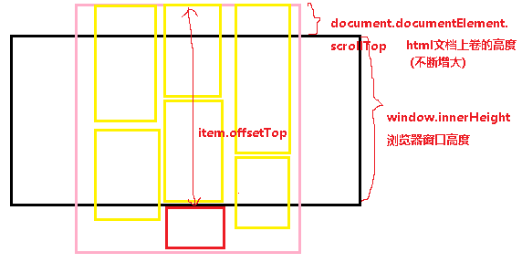

预览效果：

https://gittig11.github.io/FrontEnd_Demos/07_waterfall-sinanews/

瀑布流的原理：

- 设置图片宽度一致
- 页面主体分为三列
- 当图片加载完成，每次把新的子元素添加到高度最小的那一列。
- 父容器高度取列表数组的最大值

图片懒加载的原理：

监听 scroll 事件；当 `item.offsetTop < window.innerHeight + document.documentElement.scrollTop` 时，加载`item`。

数据来源：

- [新浪新闻API](https://photo.sina.cn/aj/v2/index?cate=military&pagesize=10&page=1)

- 通过$.ajax({}) 获取数据（JSONP跨域获取数据！）

参考：
[evenyao/waterfall-sinanews](https://github.com/evenyao/waterfall-sinanews)

